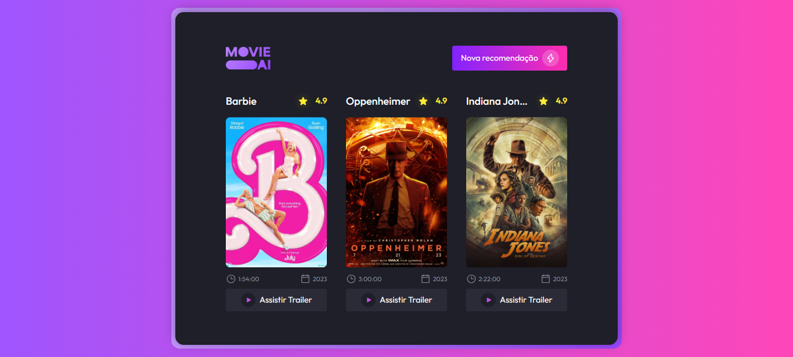

<h1 align="center"> 
Suggestion Generator (Movies)
</h1>

Desenvolvimento de um gerador de sugestão de filmes com inteligência artificial.

  

 

  

 

## 🚀 Tecnologias

Esse projeto foi desenvolvido com as seguintes tecnologias:

- HTML e CSS
- Figma
- Javascript
- API [TMDB](https://developer.themoviedb.org/reference/movie-popular-list)

 

## DEMO

## 🔖 Layout

Você pode visualizar o layout do projeto através [DESSE LINK](https://www.figma.com/community/file/1266028958590001589). É necessário ter conta no [Figma](https://figma.com) para acessá-lo.

 

## 📝 License

Esse projeto está sob a licença MIT.

---

Feito por Ciro Batista da Silva
